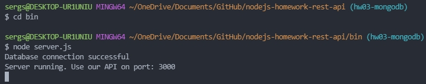

    


# REST API Conbook


## У вас много контактов и не хватает места для их хранения?

### Web Приложения [Conbook](https://github.com/SergiyStetsenko/nodejs-homework-rest-api) предоставляет вам возможность бесплатно хранить данные на сервере , иметь к ним доступ, и освободить память устройства.

 ## Описание 
 Хранит список контактов на сервере обеспечивая высокий уровень защиты персональных данных.
 Придоставляет возможность подключится с любого удобного устройства: телефон, планшет, компьютер.
 Вы с легкостью и удобством сможете управлять списком своих контактов редактировать его удалять и добавлять контакты.
 Также  може выберать избранные контакты с которыми  вы много общаетесь.

<!-- описания к следующей дз -->

Приложения будет доступно после авторизации пользователя !

<!--  -->

## Зависимости проекта 

Основная библиотека на базе которой работает [Conbook](https://github.com/SergiyStetsenko/nodejs-homework-rest-api) это [Express](https://www.npmjs.com/package/express) она строит быструю маршутизацию и структуру приложения благодаря своему методу Router. Взаимодействия между сервером и базой данных [MongoDB](https://www.mongodb.com/)  обеспечивает библиотека [Mongoose](https://www.npmjs.com/package/mongoose) она упрощает разработку и удобная в использовании. Одним из главных методов библиотеки есть [Schema](https://mongoosejs.com/docs/guide.html). Cо [Schema](https://mongoosejs.com/docs/guide.html) начинается взаимодействия с коллекцией [MongoDB](https://www.mongodb.com/) и определяется форма документов в этой коллекции.
Для описания данных  и контроля их валидности используется [Joi](https://www.npmjs.com/package/joi). Библиотека [Path](https://www.npmjs.com/package/path) обеспечивает построения путей между файлами Web - приложения.


## Версии приложения  [Conbook](https://github.com/SergiyStetsenko/nodejs-homework-rest-api):

### На данный момент последняя версия приложения 2.1.0. 

	* Добавленно базу данных и настроено подключения к серверу.

	* Оптимизировано работу функций. 

	* Добавленно новый маршрут ```@ PATCH /api/contacts/:contactId/favorite```  он показывает поле статус и принимает логическое значение true или false


## В версии 2.1.0.  присутсвует 6 путей 

```@ GET /api/contacts```  - домашняя страница приложения, на ней отображаются списки контактов               


```@ GET /api/contacts/:contactId```  - ищет контакт с указаным Id


```@ POST /api/contacts``` - добавляет нового пользователя 


```@ DELETE /api/contacts/:contactId``` - удаляет контакт по Id c Conbook


```@ PATCH /api/contacts/:contactId``` -  изменяет информацию о контакте (мин. одно изменения)


```@ PATCH /api/contacts/:contactId/favorite``` - показывает поле статуса 


## Для загрузки файла Контакты в приложения используется графический редактор [MongoDB Compass](https://www.mongodb.com/try/download/compass) после успешного добавления файла 


нажмите кнопку Import и данные будут добавлены в [Conbook](https://github.com/SergiyStetsenko/nodejs-homework-rest-api)


 Для запуска сервера прописываем команды как  показано в примере. В терминале пишем команду ``` cd bin ``` эта команда переводит в папку для запуска сервера и прописываем ``` node server.js``` после происходит запуск сервера.




